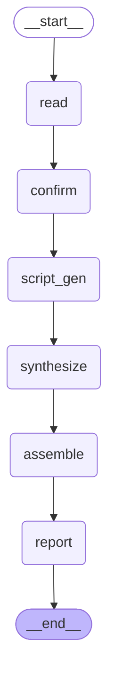

# QA Pipeline Graph

Topology of the LangGraph QA pipeline in `full` mode (`read → script_gen → synthesize → assemble → report`).

## Sub-graphs

* **`process` mode** (`--process-only`): `read → confirm → script_gen → report → END` — no TTS, no M4B.
* **`synthesize` mode** (`--synthesize-only`): `load_scripts → synthesize → assemble → report → END` — scripts are loaded from a previous `--process-only` run.
