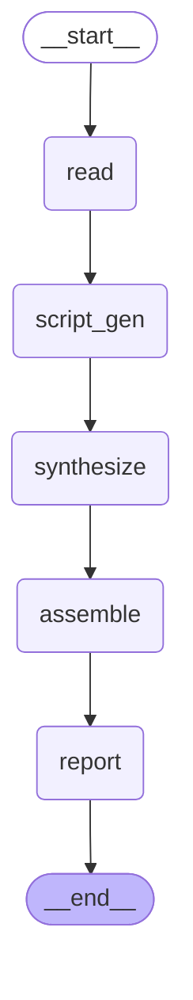

# QA Pipeline Graph

Topology of the LangGraph QA pipeline (`read → script_gen → synthesize → assemble → report`).

```mermaid
graph TD;
	__start__([<p>__start__</p>]):::first
	read(read)
	script_gen(script_gen)
	synthesize(synthesize)
	assemble(assemble)
	report(report)
	__end__([<p>__end__</p>]):::last
	__start__ --> read;
	assemble --> report;
	read --> script_gen;
	script_gen --> synthesize;
	synthesize --> assemble;
	report --> __end__;
	classDef default fill:#f2f0ff,line-height:1.2
	classDef first fill-opacity:0
	classDef last fill:#bfb6fc

```
