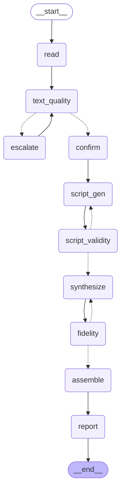

# QA Pipeline Graph

Topology of the LangGraph QA pipeline in `full` mode (`read → text_quality → escalate ↔ text_quality → confirm → script_gen → script_validity → synthesize → fidelity → assemble → report`).

## Cycle 1 — text-quality escalation edge

`text_quality` inspects each chapter from the reader with cheap heuristics (empty-after-clean, mojibake ratio, whitespace ratio, non-word ratio). Garbage chapters trigger an escalation back-edge to `escalate`, which re-extracts using a more capable parser (raw ebooklib walking for EPUB, sort-mode PyMuPDF or OCR for PDF). Bounded to 3 attempts per chapter; on exhaustion the best-effort text is kept and the chapter is flagged in the report.

## Cycle 2 — script-validity reroute edge

`script_validity` sits between `script_gen` and `synthesize`. It uses a word-count pre-filter and an LLM judge to check each generated script for faithfulness (no summaries, refusals, or error messages) and policy compliance (no raw code blocks read aloud). When it detects a bad script it loops back to `script_gen` on a reroute edge, bounded to 3 retries per chapter. On exhaustion the best-effort script is kept and the chapter is flagged in the report; the run never aborts.

## Cycle 3 — fidelity retry edge

`fidelity` boundary-samples each freshly-synthesized episode (head/tail STT round-trip + duration ratio). When it suspects TTS truncation it loops back to `synthesize` to re-chunk the offending episode on a smaller batch size, bounded to 3 retries per chapter (the `fidelity → synthesize` back-edge above). On exhaustion the lowest-WER attempt is kept and the chapter is flagged in the report; the run never aborts.

## Sub-graphs

* **`process` mode** (`--process-only`): `read → text_quality → escalate ↔ text_quality → confirm → script_gen → script_validity → report → END` — no TTS, no M4B; cycle-1 and cycle-2 apply, cycle-3 (fidelity) is skipped because no synthesis occurs.
* **`synthesize` mode** (`--synthesize-only`): `load_scripts → synthesize → fidelity → assemble → report → END` — scripts are loaded from a previous `--process-only` run; only cycle-3 applies.
